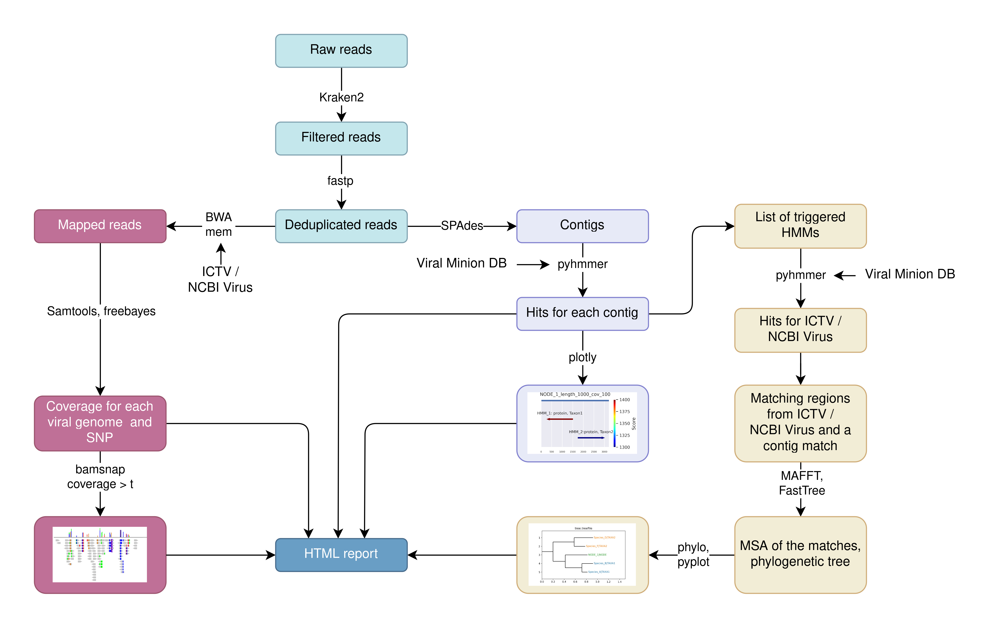
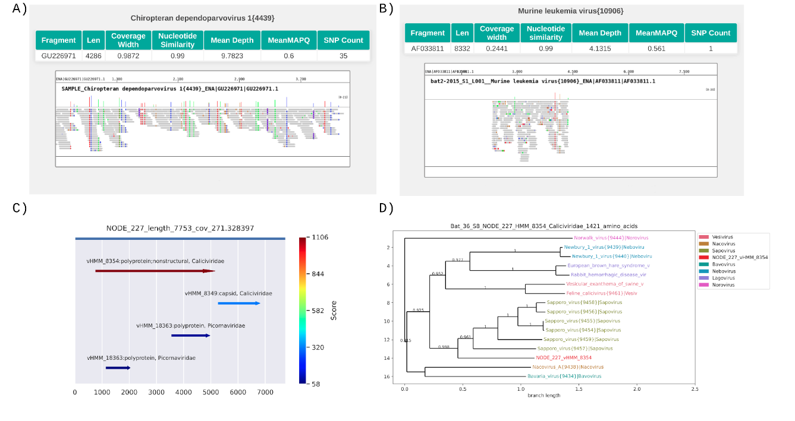
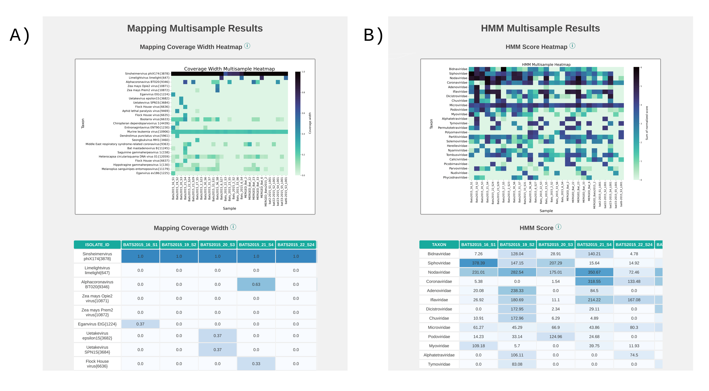

# AliMarko (Alignment & Markov Models) <span >v0.8 </span>


A Pipeline for studying the representation of viral sequences for scientific purposes.

AliMarko is designed to automate essential analysis steps for viral sequence data processing. It combines read alignment to viral reference genomes and Hidden Markov Models (HMM) with futher phylogenetic analysis (see Fig.1).  

AliMarko recieve FASTQ files and creates easy-to-read HTML reports. 

A sample HTML report contains tabular and graphical representations of alignment to all sequences from a reference database and HMM analysis (see Fig.2)

A multisample HTML report contains tabular results and heatmaps for alignment to a reference database and HMM analyzis (see Fig.3)


The pipeline can process several FASTQ files (samples) in parallel due using of Snakemake. 

## Fig. 1. Commmon scheme
1. Receive FASTQ files through the pipeline.
2. Filter out reads recognized as belonging to cellular organisms using Kraken2.
3. Remove duplicates with fastp.
4. Map deduplicated FASTQ to a viral genome database with BWA mem.
5. Calculate coverage and SNPs for all viral genomes with freebayes.
6. Generate mapping visualizations for highly covered genomes with bamsnap.
7. Assemble reads from deduplicated FASTQ using SPAdes to obtain contigs.
8. Analyze contigs with HMM using pyhmmer and our custom script.
9. Create visualizations for all contigs with pyplot.
10. Exclude amino acid sequnce of the HMM matches with a custom script.
11. Make a phylogenetic tree of a match with similar matches of the same model to the reference database using MAFFT and FastTree.
12. Create visualizations of the phylogenetic trees with pyplot.
13. Compile HTML reports summarizing all results. 


*Fig 1. Common scheme of the pipeline*

## Fig. 2. Screenshot of a sample report

*Fig. 2. Screenshots of the one-sample HTML report of AliMarko. A - a screenshot of the html report with visualization of alignment to a virus reference genome (simulated). Information about the reference and general information about alignment is shown in a table. If the reference genome contains several fragments. B - visualization of probably concatenation-caused alignment to a genome of Murine leukemia virus. While one fragment of the reference had good coverage depth, other parts of the genome aren’t covered at all. C - visualization of matches of HMM against a contig. The matches are colored by their score. Several models matched the contig. D - and example of a phylogenetic tree of contig (see C). Sequences in the tree are colored with their taxonomic group.*

## Fig. 3. Screenshot of a multisample report

*Fig. 3. The file contains heatmaps and scrollable tables for results of analysis of mapping to reference sequences and analysis using HMM*

## Usage
On current stage, you have to edit input parameters right at the begining of snakemake files


Requirements:
* conda
* snakemake
* a kraken database

Install snakemake with mamba

```bash
conda create -n AliMarko
conda activate AliMarko
conda install -c conda-forge mamba
mamba install -c conda-forge -c bioconda snakemake
```


Before running the first time, run. 
```bash
wget https://genome-idx.s3.amazonaws.com/kraken/16S_Greengenes13.5_20200326.tgz # Download an example Kraken2 database
tar -xvf 16S_Greengenes13.5_20200326.tgz # Decompres it
7z x ictv_virus_reference.fa.7z # Decompress the providen reference viral sequnces
```
This code initializes all databases for use. The 16S_Greengenes13 Kraken database was downloaded solely for testing the functionality of the pipeline and doesn't fit its primary purposes


Run the pipeline
```bash
snakemake -s AliMarko_paired_snakemake.py --use-conda --cores 2 # Run the pipeline
```

## Used databases
1. We offer a database of reference viral sequences compiled from GenBank accessions from the [ICTV's Viral Metadata Resourse](https://ictv.global/vmr)
2. We offer two HMM profiles downloaded from [Viral Minion Database](http://www.bioinfovir.icb.usp.br/minion_db/)


